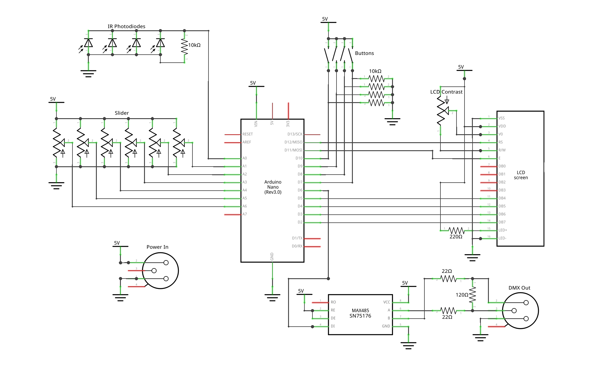

IR2DMX Manual
=============

## Introduction and function

The IR2DMX, on triggering, sends out DMX pulses on two dimmer channels which can be configured individually. It can also statically set the two following channels for each of the pulsed channels.

The device is meant to be used with studio IR camera flashes but can also be triggered manually for testing.

All signals for both channels will be output on _both_ XLR jacks. The middle jack is for powering the IR2DMX with the included USB to DMX cable. See below for more info.

## Definitions

There is a left output `L` and a right output `R`. Each of those have three consecutive channels, labelled `D` (Dimmer), `S` (Shutter) and `E` (Effect).

The 6 sliders are, from left to right, referred to as `LD`, `LS`, `LE`, `RD`, `RS`, `RE`.

Meanwhile the four buttons will be `lu` (Left up), `ld` (Left down), `ru` (Right up) and `rd` (Right down).

The small black squares on the side of the device are the IR Sensors.

## Display indicators

By default, the display shows all values currently set for each channel of both outputs. The `L` output is on top and the `R` one below.

When the IR2DMX is triggered, it will display an exclamation mark next to the output label, like so: `L!`, `R!` for the duration of the DMX pulse.

## Setup

Follow these steps to set up your IR2DMX device.

### Mounting

The IR2DMX should be positioned in such a way that the sensors point towards the IR flash. For secure and flexible mounting, you can use the tripod thread on the bottom of the device.

### Power

Connect the middle XLR jack to a power outlet using the included USB to XLR cable and a USB power adaptor. Please only use quality USB power adaptors with 1A+ since we experienced some issues with very cheap ones.

### IR sensitivity

To configure the base settings, press both left buttons (`lu` and `ld`) simultaneously. On the display, the settings menu will appear.

Using the left buttons, you can now adjust the IR sensitivity threshold. To do this, actuate your IR trigger in front of the IR sensors. If an exclamation mark appears on the display, the IR pulse was successfully detected. If not, try lowering the IR sensitivity threshold until the pulse is detected. Then, retreat with your IR flash to your normal distance. Distances up to 10m can work, although outdoors the maximum is usually around 2-3m, with a little more at night. Lower the IR sensitivity threshold until it works at your desired distance. If your device constantly shows the exclamation mark, try heightening the IR sensitivity threshold or shielding the device from potential outside IR influences.

To exit the settings menu, press both left buttons simultaneously again.

### Pulse length

To configure the base settings, press both left buttons (`lu` and `ld`) simultaneously. On the display, the settings menu will appear.

Using the right buttons, you can now adjust the DMX pulse length. Various different devices might need a longer or shorter pulse for proper actuation. The value is displayed in milliseconds.

To exit the settings menu, press both left buttons simultaneously again.

### Channels

To configure the left and right base (dimmer) channels, use the corresponding buttons next to the display. Press and hold a button to scroll channels more quickly.

### DMX wiring

Next, connect your DMX devices. The channel you want to pulse should be the base channel for the output used. If you need to control for example two static channels and the third channel should be pulsed, you need to modify and reflash our open-source firmware for now.

### Channel values

Using the sliders, you can now adjust the channel values. The static channels will be updated on the wire as soon as they are changed using the slider, while the pulsed dimmer channel will only take its value during pulse triggering, and stay 0 otherwise.

### Testing

To test whether the DMX pulse output works if you don't have an IR flash on hand, press both right buttons (`ru` and `rd`) simultaneously. An exclamation mark should be shown on the display and a DMX pulse should be sent to both DMX connectors.

## Usage

Your IR2DMX should be operational now. Whenever the IR flash actuates, the dimmer channels will be set to their slider position's values for the pulse length defined and then jump back to 0.

If there are any problems, feel free to contact us, the creators, using a [GitHub issue](https://github.com/GladOSkar/IR2DMX/issues) or our EMail addresses if you have those.

## Advanced configuration

If our UI/UX is too rigid for your usecases, feel free to modify our firmware.

The firmware is written in Arduino C++ and can be compiled easily using the Arduino IDE. All parametric values can be found at the top of the main source file [IR2DMX.ino](https://github.com/GladOSkar/IR2DMX/blob/master/IR2DMX.ino). The two required dependencies `DmxSimple` and `LiquidCrystal` can be found using the Arduino library manager.

In order to flash the microcontroller, open the IR2DMX using the 4 top-facing screws and then use a mini-USB cable to connect to the controller board inside. Please be careful with the wiring inside though, as the cables are quite short.

When releasing our firmware and your modifications, keep in mind the source code licensing put in place by us in the file [LICENSE](https://github.com/GladOSkar/IR2DMX/blob/master/LICENSE). Out of curiosity we'd gladly hear about all modifications!

## Technical details

More details about the exact wiring and electronics can be found in the code and in the schematic:

Parts list:

- Arduino Nano (chinese knockoff)
- RS-485 Transceiver (MAX485 or SN75176)
- Resistors: 5x 10k, 1x220, 1x120, 2x22 Ohms
- 6 10kOhm linear potentiometers
- 1 10kOhm potentiometer (can be replaced with resistors for fixed contrast)
- 4 Buttons
- A bunch of IR photodiodes (Here BP104 because of their wide angle of sensitivity)
- 2 Female XLR jacks
- 1 Male XLR jack